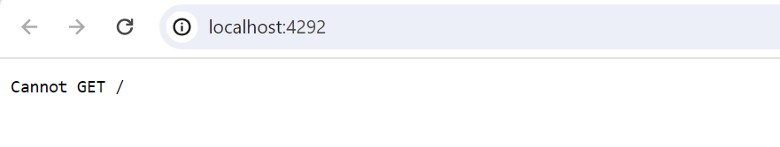
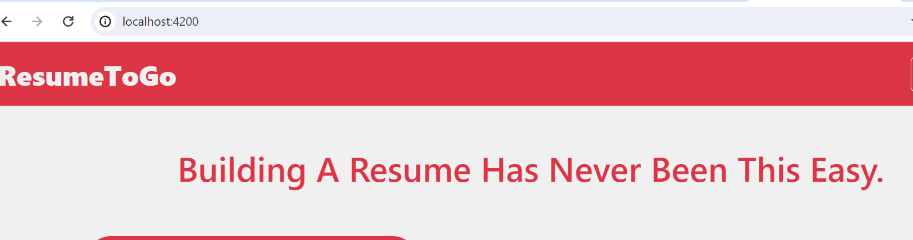

# ResumeAI

## Overview

The project is a MEAN project and uses node version 18.

# Run project locally

* Clone the repository in your local system.
* Created a .env file for environment variables
```
MONGO_URL="mongodb+srv://**************/resume_builder"
JWT_SECRET_KEY="MYREALLYSECRETKEY"
OPENAI_KEY="OPENAI_API_KEY"
GMAIL_USER="THIS EMAIL IS USED TO SEND RESUMES"
GMAIL_PASS="PASSWORD USED BY NODEMAILER"
FRONT_END="URL FOR FRONTEND"
```
* Go to ResumeBuilderBackend folder and intall the dependencies mentioned below
```
npm install
npm install -g typescript
tsc --build
```
*  After installing build the application.
```
npm run start
```
* Test the localhost:4292 for an output
```
Cannot GET /
```

* Then install dependencies in frontend move to ResumeBuilderAngular and run the commands mentioned below
```
npm install -g @angular/cli
npm install -g angular-http-server
npm install --force
```
* Run the application 
```
npm start
```
* Test the localhost:4200 for an output


Congrats your local set up is done next will procede with Dockerfile
